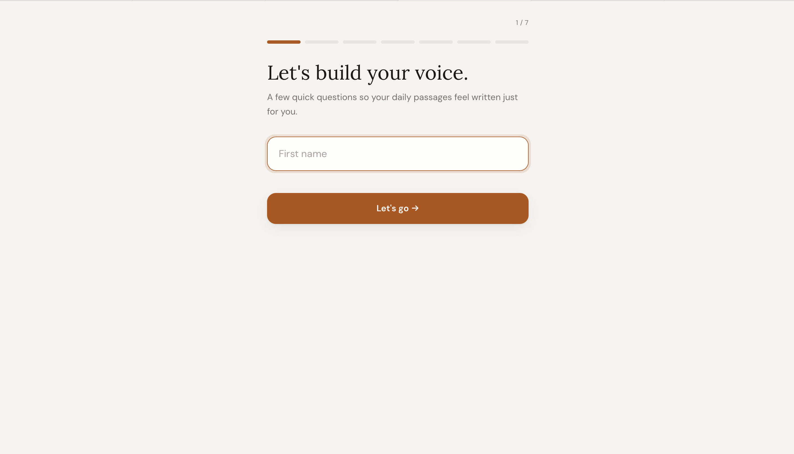
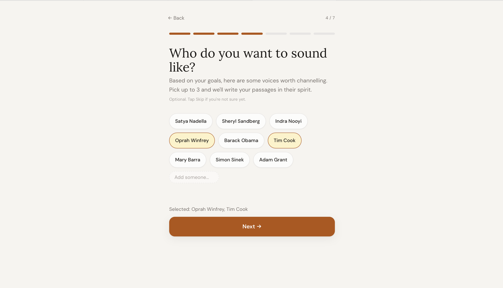
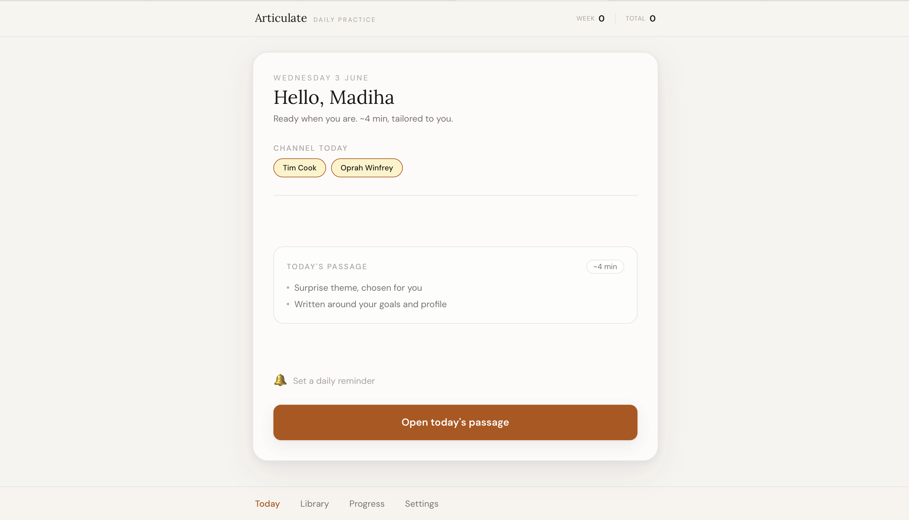
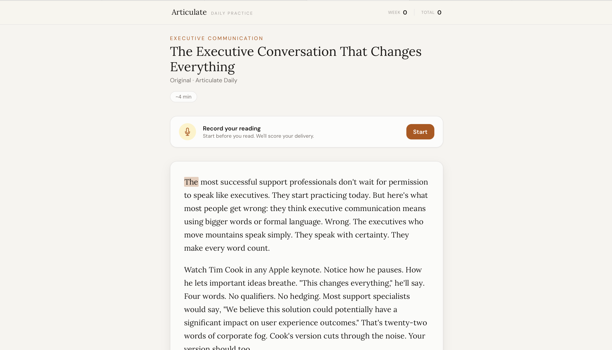
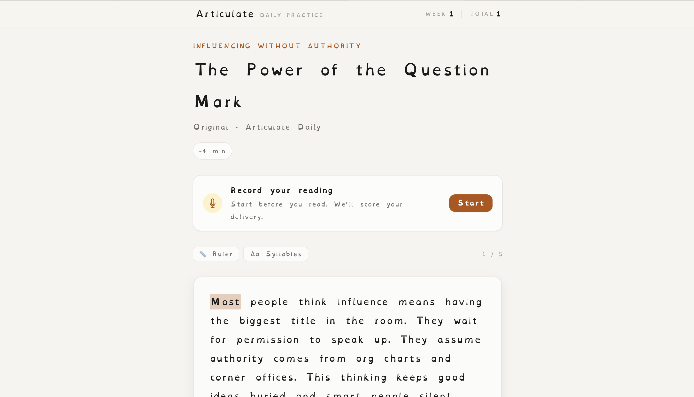
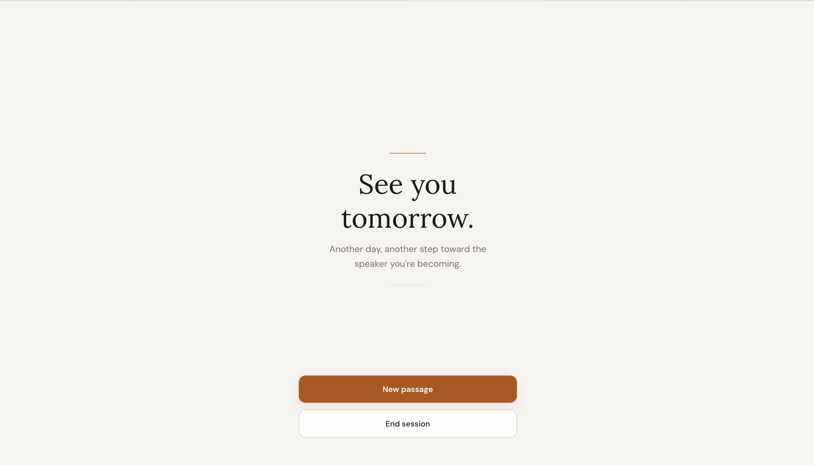

# Articulate

**[Try it live →](https://articulate-app-production.up.railway.app)** · **[GitHub](https://github.com/KhanKMadiha/articulate-app)** · **[Portfolio](https://madihaintech.me)**

A daily speaking practice app. Claude generates a personalised passage every day based on your career goals and how you want to sound. You record yourself reading it aloud. The app scores you on accuracy, fluency, and pace and tells you exactly where to improve.

Built as a full stack PWA with React, Express, and the Anthropic Claude API.

---

## The idea

A senior engineering manager told me something that stuck with me:

> "You need to learn how to speak different languages. To customers, to engineers, to execs. They all need something different."

Most of us know what we want to say. The gap is how we say it — the confidence, the clarity, the delivery. Articulate is my attempt to make that easier to practise, every day.

---

## What it does

**Personalised daily passages** — Claude generates your passage from your job title, industry, career goals, and focus areas. Not generic. Yours.

**Speaking inspirations** — choose speakers you admire and passages are written in their spirit, so you are practising the register you actually want.

**Record and score** — read aloud, record yourself, and get AI feedback on accuracy, fluency, and pace with specific guidance on where to improve.

**Dyslexia friendly mode** — wider spacing, shorter sentences, paragraph by paragraph reading, and a choice of Lexend or OpenDyslexic fonts. This also shapes how Claude generates the passage itself, not just how it is displayed.

**Daily habit** — streak tracking, a motivational moment after each session, and optional push notification reminders.

**Library** — save favourite passages to return to before a big moment.

---

## Screenshots

| Onboarding | Personalisation | Daily home |
|---|---|---|
|  |  |  |

| Passage with recording | Dyslexia mode | Session complete |
|---|---|---|
|  |  |  |

---

## Tech stack

| Layer | Technology |
|-------|------------|
| Frontend | React 18, Vite, Tailwind CSS |
| Backend | Node.js, Express |
| AI | Anthropic Claude API (passage generation + speech scoring) |
| Speech | Web Speech API (SpeechRecognition) |
| PWA | Vite PWA plugin, service worker, Web Push |
| Fonts | Lora (serif), DM Sans (sans-serif), Lexend / OpenDyslexic |
| Deployment | Railway, Docker |

---

## Running locally

### Prerequisites

- Node.js 20+
- An [Anthropic API key](https://console.anthropic.com/settings/keys)
- **Browser:** Chrome is recommended for the Web Speech API; allow microphone access when prompted

### Setup

1. **Clone the repo**

   ```bash
   git clone https://github.com/KhanKMadiha/articulate-app.git
   cd articulate-app
   ```

2. **Environment variables**

   ```bash
   cp .env.example .env
   ```

   Edit `.env` at the **repo root** (next to `package.json`):

   | Variable | Required | Description |
   |----------|----------|-------------|
   | `ANTHROPIC_API_KEY` | Yes | Full key from [console.anthropic.com](https://console.anthropic.com/settings/keys) (`sk-ant-...`) |
   | `VAPID_PUBLIC_KEY` | No | Web Push — generate with `npx web-push generate-vapid-keys` |
   | `VAPID_PRIVATE_KEY` | No | Web Push private key |
   | `VAPID_CONTACT_EMAIL` | No | `mailto:` contact for push headers |

3. **Install and run**

   From the repo root (`articulate-app/`):

   ```bash
   npm install
   npm run dev
   ```

   **First-time install:** root `npm install` only adds `concurrently`. If `npm run dev` fails on a fresh clone, install dependencies in `client/` and `server/` once:

   ```bash
   npm install --prefix server && npm install --prefix client
   ```

   (`npm run build` also runs installs for both prefixes.)

   - API: `http://localhost:3001`
   - App: `http://localhost:5173` (open this in the browser)

---

## Deployment (Railway)

The app deploys on [Railway](https://railway.app) using the root **Dockerfile** (primary). `nixpacks.toml` is included for an alternative Railway/Nixpacks build path if you prefer that over Docker.

1. Connect the [GitHub repo](https://github.com/KhanKMadiha/articulate-app) and deploy from `main`
2. Set **Root Directory** to the **repo root** (where `package.json` and `Dockerfile` live — not `client/` or `server/`)
3. Use **Dockerfile** as the builder (or Nixpacks via `nixpacks.toml`)
4. Add environment variables:

   | Variable | Required | Description |
   |----------|----------|-------------|
   | `ANTHROPIC_API_KEY` | Yes | Claude API key |
   | `VAPID_PUBLIC_KEY` | No | Push notifications |
   | `VAPID_PRIVATE_KEY` | No | Push notifications |
   | `VAPID_CONTACT_EMAIL` | No | Email for VAPID `mailto:` |
   | `PORT` | No | Set by Railway (defaults to `3001` locally) |

   Generate VAPID keys:

   ```bash
   npx web-push generate-vapid-keys
   ```

Production serves the built client from Express on port **3001**. Live app: [articulate-app-production.up.railway.app](https://articulate-app-production.up.railway.app).

---

## Project structure

```
articulate-app/
├── package.json          # Root scripts (dev, build, start)
├── .env.example          # Copy to .env at repo root
├── Dockerfile            # Production image (Railway, primary)
├── nixpacks.toml         # Optional Railway/Nixpacks build
├── LICENCE               # MIT
├── client/               # React + Vite frontend
│   ├── src/
│   │   ├── pages/        # Home, Read, Onboarding, Settings, Favourites, Progress
│   │   ├── components/   # AppShell, SpeakerInput, …
│   │   ├── hooks/        # useRecorder (speech recording)
│   │   └── lib/          # API, storage, notifications, constants
│   └── public/           # PWA assets
└── server/
    └── index.js          # Express API — passages, scoring, push
```

---

## Scripts

Run from the **repo root**:

| Script | Description |
|--------|-------------|
| `npm run dev` | Express (3001) + Vite dev server (5173) via `concurrently` |
| `npm run dev:client` | Vite only (`client/`) |
| `npm run dev:server` | Express with `--watch` (`server/`) |
| `npm run build` | Install dependencies and build `client/` for production |
| `npm start` | Production server (`NODE_ENV=production`, serves `client/dist`) |

---

## Privacy & API usage

- **Do not commit `.env`** — it is not tracked by Git; use `.env.example` as a template only
- Passages and scores are sent to the **Anthropic API** from your server using `ANTHROPIC_API_KEY`
- Profile and progress data stay in the **browser** (localStorage); the server does not store user accounts
- Microphone access uses the **Web Speech API** in the browser for recording/scoring flows
- Push subscriptions are held **in memory** on the server (reset on redeploy)

---

## Built with

- [Anthropic Claude](https://www.anthropic.com) — passage generation and speech scoring
- [Vite PWA Plugin](https://vite-pwa-org.netlify.app/) — service worker and installable PWA
- [web-push](https://github.com/web-push-libs/web-push) — Web Push notifications
- [Railway](https://railway.app) — hosting

---

## Links

- **Live demo:** [articulate-app-production.up.railway.app](https://articulate-app-production.up.railway.app)
- **Source:** [github.com/KhanKMadiha/articulate-app](https://github.com/KhanKMadiha/articulate-app)
- **Portfolio:** [madihaintech.me](https://madihaintech.me)

---

## Licence

MIT — see [LICENCE](LICENCE). Use and adapt freely; attribution appreciated.
